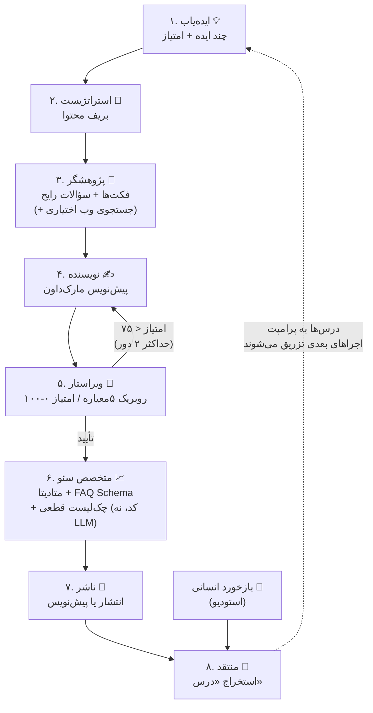

# آرکان — سیستم مولتی‌ایجنت تولید بلاگ‌پست (فاز ۳)

> محتوای آموزشی هفته‌ی ششم دوره‌ی هوش مصنوعی — ساخت یک سیستم **مولتی‌ایجنت** واقعی که کل چرخه‌ی تولید محتوا را پوشش می‌دهد: از پیدا کردن ایده تا نگارش، سئو، انتشار، و **بهبود خودش در طول زمان**.

این پروژه فاز سوم پروژه‌ی «شرکت آرکان» است (فاز ۱: وب‌سایت، فاز ۲: چت‌بات RAG). همان استک آشنا: **Next.js 14 + AI SDK + OpenRouter + Supabase**.

---

## ۱. مولتی‌ایجنت یعنی چه و چرا؟

یک LLM با یک پرامپت غول‌پیکر («یک مقاله‌ی سئوشده بنویس») خروجی متوسطی می‌دهد، چون دارد هم‌زمان چند «شغل» متفاوت را انجام می‌دهد: ایده‌پردازی، پژوهش، نگارش، نقد، سئو. هر شغل، مهارت، لحن و دمای (temperature) متفاوتی می‌خواهد.

راه‌حل همان کاری است که یک تحریریه‌ی واقعی می‌کند: **تقسیم کار بین متخصص‌ها**. هر ایجنت یک LLM است با:

- یک **system prompt تخصصی** (فقط یک شغل)
- یک **قرارداد خروجی صریح** (اسکیمای Zod — خروجی هر ایجنت، ورودی ایجنت بعدی است)
- **تنظیمات مخصوص خودش** (ایده‌یاب دمای بالا برای خلاقیت؛ ویراستار دمای پایین برای قضاوت پایدار)

## ۲. معماری سیستم



### ایجنت‌ها

| # | ایجنت | ورودی | خروجی | نکته‌ی طراحی |
|---|-------|-------|-------|---------------|
| ۱ | **ایده‌یاب** | پروفایل شرکت + عنوان پست‌های قبلی | ۵ ایده‌ی امتیازدهی‌شده | دمای بالا (۰.۸) برای تنوع؛ عنوان‌های قبلی را می‌گیرد تا تکرار نکند |
| ۲ | **استراتژیست** | ایده‌ها | بریف محتوا (مخاطب، کلیدواژه، ساختار، CTA) | جداکردن «تصمیم» از «تولید» — مثل تحریریه‌ی واقعی |
| ۳ | **پژوهشگر** | بریف | فکت‌ها، مثال‌ها، سؤالات رایج | الگوی «مدل تصمیم می‌گیرد، کد اجرا می‌کند»: LLM کوئری طراحی می‌کند، `fetch` جستجو می‌کند |
| ۴ | **نویسنده** | بریف + پژوهش | مقاله‌ی کامل مارک‌داون | تنها ایجنت با خروجی متن آزاد (مصرف‌کننده‌اش انسان است، نه ایجنت) |
| ۵ | **ویراستار** | بریف + پیش‌نویس | امتیاز + فهرست ایراد | الگوی **Generator/Critic**: نقاد باید از تولیدکننده جدا باشد |
| ۶ | **متخصص سئو** | مقاله‌ی نهایی | اسلاگ، متا، FAQ Schema | نیمی LLM (قضاوتی)، نیمی **کد قطعی** (`seo-checks.ts`) — هرچیز قابل‌محاسبه را به LLM نسپارید |
| ۷ | **ناشر** | همه‌چیز | رکورد پست در دیتابیس | امتیاز ≥ ۷۵ → انتشار خودکار؛ کمتر → پیش‌نویس تا تأیید انسان (**human-in-the-loop**) |
| ۸ | **منتقد** | گزارش کل اجرا + بازخورد انسانی | حداکثر ۳ «درس» | موتور **خودبهبودی** — پایین‌تر توضیح داده شده |

### ارکستریتور — مهم‌ترین درس این هفته

ارکستریتور ([orchestrator.ts](src/lib/agents/orchestrator.ts)) **خودش LLM نیست؛ کد قطعی است.**

- «تصمیم‌های خلاقانه» → ایجنت‌ها (LLM)
- «جریان کار» (ترتیب، حلقه‌ی بازبینی، شرط‌ها، ثبت وضعیت) → کد معمولی

رایج‌ترین اشتباه در ساخت سیستم‌های مولتی‌ایجنت این است که orchestration را هم به یک LLM «مدیر» بسپارید. جریان کار باید قابل پیش‌بینی، قابل دیباگ و قابل تست باشد — این‌ها ویژگی کد است، نه مدل.

### مکانیزم خودبهبودی (Self-Improvement)

حلقه‌ی بسته‌ی یادگیری، بدون fine-tuning و بدون تغییر کد:

1. بعد از هر اجرا، **منتقد** کل فرایند را مرور می‌کند (امتیاز ویراستار، تعداد دور بازنویسی، چک‌های سئوی ردشده، خود متن) و حداکثر ۳ **درس** استخراج می‌کند. هر درس خطاب به یک ایجنت مشخص است: *«writer: در مقدمه به‌جای کلی‌گویی، با یک مسئله‌ی ملموس مخاطب شروع کن»*
2. بازخورد انسانی (👍/👎 + توضیح در استودیو) هم از همین مسیر به درس تبدیل می‌شود.
3. درس‌ها در جدول `lessons` ذخیره می‌شوند و [lessons.ts](src/lib/agents/lessons.ts) قبل از هر اجرا، درس‌های فعالِ هر ایجنت را به system prompt او تزریق می‌کند.
4. سقف ۸ درس فعال به‌ازای هر ایجنت (درس‌های قدیمی‌تر بازنشسته می‌شوند) و امکان حذف دستی درس اشتباه در استودیو — **نظارت انسانی روی حافظه، خودِ مکانیزم را سالم نگه می‌دارد.**

### الگوهای مهندسی که در کد می‌بینید

- **قرارداد خروجی + اعتبارسنجی + retry** ([ai.ts](src/lib/ai.ts)): خروجی JSON هر ایجنت با Zod اعتبارسنجی می‌شود؛ اگر خراب بود، خطا به مدل برمی‌گردد تا اصلاح کند.
- **دروازه‌ی کیفیت (Quality Gate)** ([editor.ts](src/lib/agents/editor.ts)): امتیاز زیر ۷۵ → برگشت به نویسنده، حداکثر ۲ دور. بعد از سقف، تصمیم به انسان واگذار می‌شود.
- **وضعیت در دیتابیس، نه در حافظه** ([orchestrator.ts](src/lib/agents/orchestrator.ts)): هر گام بلافاصله در store ثبت می‌شود؛ استودیو با polling ساده نمای زنده می‌سازد.
- **الگوی Adapter در ذخیره‌سازی** ([store/](src/lib/store/)): بدون Supabase در «حالت حافظه» اجرا می‌شود؛ کل سیستم فقط با interface `BlogStore` کار می‌کند.
- **کار قطعی را به LLM نسپار** ([seo-checks.ts](src/lib/agents/seo-checks.ts)): طول متا، تعداد H1، حضور کلیدواژه — با کد معمولی.

---

## ۳. اجرا

### پیش‌نیاز

- Node.js 18+
- کلید [OpenRouter](https://openrouter.ai) (همان کلید فاز ۲)

### راه‌اندازی محلی (۲ دقیقه)

```bash
git clone https://github.com/siavash-smf/arkan-blog-agents.git
cd arkan-blog-agents
npm install
cp .env.local.example .env.local
# فقط OPENROUTER_API_KEY را پر کنید — بقیه اختیاری است
npm run dev
```

سپس `http://localhost:3000/studio` → «شروع 🚀». بدون Supabase، سیستم در حالت حافظه اجرا می‌شود (داده‌ها با ری‌استارت پاک می‌شوند — برای یادگیری کافی است).

### تنظیمات اختیاری

| متغیر | کارکرد |
|-------|--------|
| `TAVILY_API_KEY` | جستجوی واقعی وب برای پژوهشگر (کلید رایگان از tavily.com) |
| `NEXT_PUBLIC_SUPABASE_URL` + `SUPABASE_SERVICE_ROLE_KEY` | ذخیره‌سازی دائمی — اول [supabase/schema.sql](supabase/schema.sql) را در SQL Editor اجرا کنید |
| `WRITER_MODEL` | مدل قوی‌تر فقط برای نویسنده (مثلاً `anthropic/claude-sonnet-4.5`) |
| `STUDIO_PASSWORD` | قفل استودیو برای دیپلوی عمومی |
| `CRON_SECRET` | محافظت endpoint کرون |

### دیپلوی روی Vercel

1. ریپو را به Vercel وصل کنید و متغیرهای بالا را ست کنید (Supabase اینجا **اجباری** است).
2. فایل [vercel.json](vercel.json) یک کرون هفتگی تعریف کرده (دوشنبه‌ها ۶ صبح UTC → `/api/cron/weekly`) — یعنی **هر هفته خودکار یک مقاله‌ی جدید** تولید می‌شود؛ اگر ویراستار تأیید کند مستقیم منتشر می‌شود، وگرنه در استودیو منتظر تأیید شما می‌ماند.

---

## ۴. ساختار پروژه

```
src/
├── lib/
│   ├── ai.ts                 ← هسته: OpenRouter + runAgentText/runAgentJSON (اعتبارسنجی + retry)
│   ├── company.ts            ← پروفایل شرکت و لحن برند (زمینه‌ی مشترک همه‌ی ایجنت‌ها)
│   ├── auth.ts               ← محافظ ساده‌ی استودیو
│   ├── agents/
│   │   ├── types.ts          ← قرارداد خروجی ایجنت‌ها (اسکیماهای Zod)
│   │   ├── lessons.ts        ← تزریق درس‌ها به پرامپت (خودبهبودی)
│   │   ├── idea-scout.ts     ← ایجنت ۱: ایده‌یاب
│   │   ├── strategist.ts     ← ایجنت ۲: استراتژیست
│   │   ├── researcher.ts     ← ایجنت ۳: پژوهشگر (+ Tavily اختیاری)
│   │   ├── writer.ts         ← ایجنت ۴: نویسنده (نگارش + بازنویسی)
│   │   ├── editor.ts         ← ایجنت ۵: ویراستار (روبریک + دروازه‌ی کیفیت)
│   │   ├── seo.ts            ← ایجنت ۶: متخصص سئو
│   │   ├── seo-checks.ts     ← چک‌های قطعی سئو (بدون LLM!)
│   │   ├── critic.ts         ← ایجنت ۸: منتقد (استخراج درس از اجرا و بازخورد)
│   │   └── orchestrator.ts   ← رهبر ارکستر — کد قطعی، نه LLM
│   └── store/                ← لایه‌ی ذخیره‌سازی (Adapter: حافظه یا Supabase)
├── app/
│   ├── studio/               ← داشبورد: خط تولید زنده + پست‌ها + درس‌ها
│   ├── blog/                 ← بلاگ عمومی + صفحه‌ی مقاله (متا + JSON-LD)
│   └── api/
│       ├── pipeline/…        ← اجرای پایپ‌لاین + وضعیت زنده
│       ├── posts/…           ← مدیریت انتشار (human-in-the-loop)
│       ├── feedback/         ← بازخورد انسانی → درس
│       ├── lessons/          ← مشاهده/حذف حافظه‌ی خودبهبودی
│       └── cron/weekly/      ← اجرای خودکار هفتگی
└── supabase/schema.sql       ← اسکیمای ۴ جدول
```

---

## ۵. تمرین‌های دانشجویان 🎓

**سطح ۱ — دستکاری:**
1. `APPROVE_THRESHOLD` را در `editor.ts` به ۹۰ برسانید و ببینید چند دور بازنویسی اضافه می‌شود. هزینه/کیفیت را مقایسه کنید.
2. `company.ts` را با اطلاعات یک کسب‌وکار دیگر (مثلاً یک کافه) عوض کنید و یک اجرای کامل بگیرید.
3. در تب «درس‌ها» یک بازخورد منفیِ مشخص بدهید و در اجرای بعدی، رد پای آن درس را در خروجی پیدا کنید.

**سطح ۲ — توسعه:**
4. یک معیار ششم به روبریک ویراستار اضافه کنید (مثلاً «استناددهی»).
5. یک چک قطعی جدید به `seo-checks.ts` اضافه کنید (مثلاً: هر H2 حداقل ۵۰ کلمه متن داشته باشد).
6. یک ایجنت نهم بسازید: «توزیع‌کننده» که برای هر مقاله ۳ پست شبکه‌ی اجتماعی بنویسد.

**سطح ۳ — معماری:**
7. اجرای موازی: ۳ ایده‌ی برتر را همزمان به ۳ استراتژیست بدهید و ویراستار بهترین بریف را انتخاب کند (`Promise.all`).
8. به‌جای polling، پیشرفت را با Server-Sent Events استریم کنید.
9. اتصال به فاز ۲: «سؤالات بی‌جواب» چت‌بات را به ایده‌یاب بدهید تا از دردهای واقعی کاربران موضوع بسازد. ⭐ *این ارزشمندترین تمرین است — دو سیستم را به یک حلقه‌ی داده تبدیل می‌کند.*

---

## ۶. سؤالات پرتکرار

**چرا خروجی JSON را با generateObject نگرفتیم؟**
چون بین ده‌ها مدل OpenRouter، پشتیبانی از JSON mode و tool-calling ناسازگار است. استخراج دستی + Zod + retry روی همه‌ی مدل‌ها کار می‌کند و مکانیزمش را هم شفاف یاد می‌گیرید. در پروژه‌ی واقعی با یک provider مشخص، `generateObject` انتخاب تمیزتری است.

**چرا ایجنت‌ها با هم «گفت‌وگو» نمی‌کنند؟**
الگوی این پروژه pipeline است، نه debate. برای تولید محتوا، جریان خطی + حلقه‌ی بازبینی هم کیفیت بهتری می‌دهد هم هزینه‌ی قابل پیش‌بینی. الگوهای گفت‌وگومحور (مثل چند ایجنت که مذاکره می‌کنند) برای مسائل اکتشافی مناسب‌ترند.

**هزینه‌ی هر اجرا چقدر است؟**
با `google/gemini-2.5-flash` حدود ۱۰ تا ۱۵ فراخوانی مدل (بسته به دورهای بازنویسی) — معمولاً چند سنت. با مدل‌های سنگین‌تر برای نویسنده، کیفیت بالاتر و هزینه بیشتر.

---

*فاز ۱: وب‌سایت آرکان · فاز ۲: چت‌بات RAG (وب + تلگرام) · **فاز ۳: سیستم بلاگ مولتی‌ایجنت** ←*
