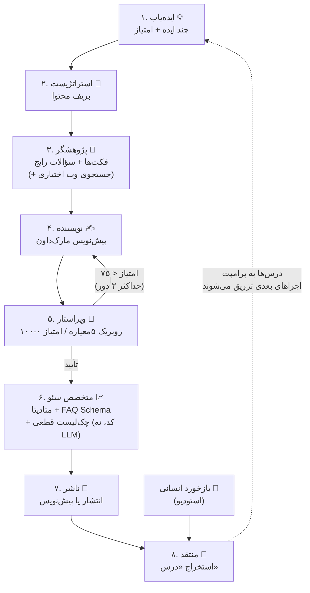
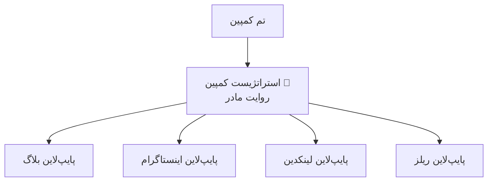
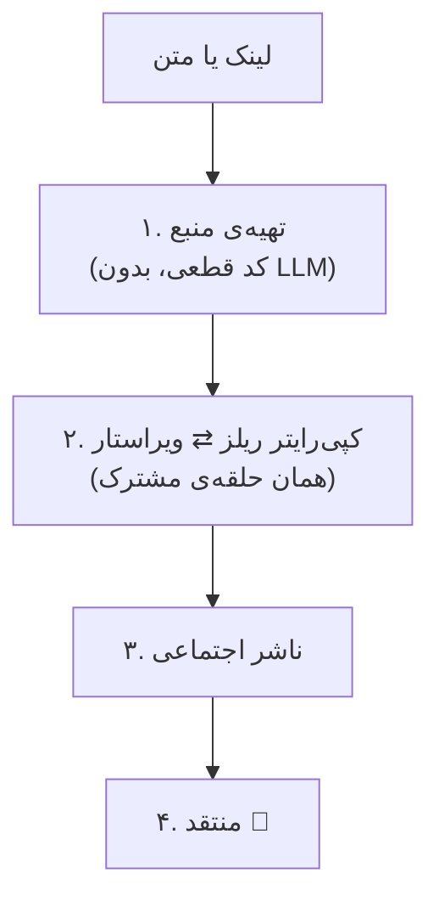
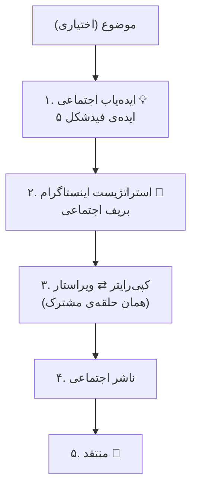
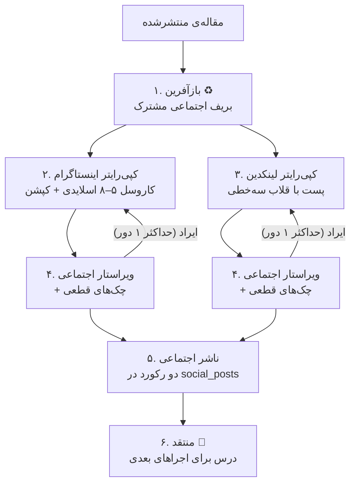

# آرکان — استودیوی مولتی‌ایجنت تولید محتوا (فاز ۳)

> محتوای آموزشی هفته‌ی ششم دوره‌ی هوش مصنوعی — ساخت یک سیستم **مولتی‌ایجنت** واقعی که کل چرخه‌ی تولید محتوا را پوشش می‌دهد: از پیدا کردن ایده تا نگارش، سئو، انتشار، بازآفرینی برای شبکه‌های اجتماعی، و **بهبود خودش در طول زمان**.

شش پایپ‌لاین مستقل دارد:

| پایپ‌لاین | ورودی | خروجی |
|---|---|---|
| **تولید بلاگ** | موضوع (اختیاری) | یک مقاله‌ی سئوشده |
| **بازآفرینی اجتماعی** | یک مقاله‌ی منتشرشده | کاروسل اینستاگرام + پست لینکدین |
| **کاروسل مستقل** | موضوع (اختیاری) | کاروسل اینستاگرام |
| **اسکریپت ریلز** | یک لینک یا یک متن | متن آماده‌ی بلندخوانی + کپشن و متن روی تصویر |
| **پست لینکدین** | «مشاهده‌ی این هفته» | پست مستقل لینکدین |
| **کمپین چندکاناله** | یک تم | روایت مادر + مقاله + کاروسل + پست لینکدین + ریلز |

همه از یک هسته‌ی مشترک استفاده می‌کنند: ثبت زنده‌ی گام‌ها، حلقه‌ی نویسنده ⇄ ویراستار، چک‌های قطعی، و حافظه‌ی درس‌ها.

این پروژه فاز سوم پروژه‌ی «شرکت آرکان» است (فاز ۱: وب‌سایت، فاز ۲: چت‌بات RAG). همان استک آشنا: **Next.js 14 + AI SDK + OpenRouter + Supabase**.

---

## 📚 اسناد آموزشی (از اینجا شروع کنید)

سه سند مکمل برای یادگیری این پروژه:

| سند | برای چه کسی / چه زمانی |
|-----|------------------------|
| **همین README** | نمای کلی معماری، اجرا، و تمرین‌های دانشجویی |
| [راهنمای آموزشی هشت ایجنت](راهنمای-آموزشی-ایجنت‌ها.md) | وقتی می‌خواهید **دقیقاً** بفهمید هر ایجنت چه می‌کند: شغل، ورودی/خروجی، تنظیمات، و «چرا» هر تصمیم طراحی |
| [پرامپت ساخت پروژه](arkan-blog-agents-claude-code-prompt.md) | همان پرامپتی که با آن کل این سیستم ساخته شد — برای بازتولید یا ساخت پروژه‌ی مشابه با Claude Code |

> پیشنهاد مسیر مطالعه: اول همین README را تا انتها بخوانید، بعد [راهنمای هشت ایجنت](راهنمای-آموزشی-ایجنت‌ها.md) را کنار کد باز کنید، و در پایان سراغ [تمرین‌ها](#۵-تمرین‌های-دانشجویان-) بروید.

---

## ۱. مولتی‌ایجنت یعنی چه و چرا؟

یک LLM با یک پرامپت غول‌پیکر («یک مقاله‌ی سئوشده بنویس») خروجی متوسطی می‌دهد، چون دارد هم‌زمان چند «شغل» متفاوت را انجام می‌دهد: ایده‌پردازی، پژوهش، نگارش، نقد، سئو. هر شغل، مهارت، لحن و دمای (temperature) متفاوتی می‌خواهد.

راه‌حل همان کاری است که یک تحریریه‌ی واقعی می‌کند: **تقسیم کار بین متخصص‌ها**. هر ایجنت یک LLM است با:

- یک **system prompt تخصصی** (فقط یک شغل)
- یک **قرارداد خروجی صریح** (اسکیمای Zod — خروجی هر ایجنت، ورودی ایجنت بعدی است)
- **تنظیمات مخصوص خودش** (ایده‌یاب دمای بالا برای خلاقیت؛ ویراستار دمای پایین برای قضاوت پایدار)

## ۲. معماری سیستم



### ایجنت‌ها

| # | ایجنت | ورودی | خروجی | نکته‌ی طراحی |
|---|-------|-------|-------|---------------|
| ۱ | **ایده‌یاب** | پروفایل شرکت + عنوان پست‌های قبلی | ۵ ایده‌ی امتیازدهی‌شده | دمای بالا (۰.۸) برای تنوع؛ عنوان‌های قبلی را می‌گیرد تا تکرار نکند |
| ۲ | **استراتژیست** | ایده‌ها | بریف محتوا (مخاطب، کلیدواژه، ساختار، CTA) | جداکردن «تصمیم» از «تولید» — مثل تحریریه‌ی واقعی |
| ۳ | **پژوهشگر** | بریف | فکت‌ها، مثال‌ها، سؤالات رایج | الگوی «مدل تصمیم می‌گیرد، کد اجرا می‌کند»: LLM کوئری طراحی می‌کند، `fetch` جستجو می‌کند |
| ۴ | **نویسنده** | بریف + پژوهش | مقاله‌ی کامل مارک‌داون | تنها ایجنت با خروجی متن آزاد (مصرف‌کننده‌اش انسان است، نه ایجنت) |
| ۵ | **ویراستار** | بریف + پیش‌نویس | امتیاز + فهرست ایراد | الگوی **Generator/Critic**: نقاد باید از تولیدکننده جدا باشد |
| ۶ | **متخصص سئو** | مقاله‌ی نهایی | اسلاگ، متا، FAQ Schema | نیمی LLM (قضاوتی)، نیمی **کد قطعی** (`seo-checks.ts`) — هرچیز قابل‌محاسبه را به LLM نسپارید |
| ۷ | **ناشر** | همه‌چیز | رکورد پست در دیتابیس | امتیاز ≥ ۷۵ → انتشار خودکار؛ کمتر → پیش‌نویس تا تأیید انسان (**human-in-the-loop**) |
| ۸ | **منتقد** | گزارش کل اجرا + بازخورد انسانی | حداکثر ۳ «درس» | موتور **خودبهبودی** — پایین‌تر توضیح داده شده |

### پایپ‌لاین ششم — کمپین چندکاناله

یک تم → «روایت مادر» → چهار کانال با زاویه‌ی اختصاصی هرکدام.



**۱. اینجا موازی درست است — برخلاف بازآفرینی.** در بازآفرینی، اینستاگرام و لینکدین
روی یک آرایه‌ی `steps` مشترک می‌نوشتند و موازی‌کردنشان گام‌ها را می‌انداخت. اینجا هر
کانال رکورد `pipeline_runs` و آرایه‌ی `steps` **خودش** را دارد، پس state مشترکی نیست.
تفاوت در «مالکیت داده» است، نه سلیقه: همزمانی وقتی امن است که هر شاخه صاحب داده‌ی
خودش باشد.

**۲. `allSettled` نه `all`.** شکست یک کانال نباید بقیه را از بین ببرد.

**۳. لنگر انداختن روی ایده‌ی بزرگ.** بلاگ و اینستاگرام بعد از گرفتن راهنمای موضوع،
خودشان ایده تولید و انتخاب می‌کنند — دو فرصت برای دورشدن از تم. در اولین اجرای
چهارکاناله، تم درباره‌ی جلسه‌ها بود ولی مقاله درباره‌ی «تصمیم‌گیری در بازار پرنوسان»
درآمد، در حالی که سه کانال دیگر سر جایشان بودند. حالا `bigIdea` به راهنمای موضوع
چسبانده می‌شود. **درسش:** در سیستم‌های چندمرحله‌ای، هر مرحله‌ای که آزادی انتخاب دارد
یک نقطه‌ی نشت از قصد اولیه است.

در پنل کمپین می‌توانید روی هر کانال کلیک کنید و خروجی واقعی‌اش را ببینید — مقاله،
کاروسل، پست لینکدین و اسکریپت ریلز — به‌همراه تایم‌لاین همان کانال.

> ⚠️ **گران‌ترین درسِ این فاز — انتشار توهم بین ایجنت‌ها.**
> در اولین اجرای کمپین، استراتژیست در زاویه‌ی لینکدین آمار ساخت («۱۰٪ رشد فروش،
> ۲٪ کاهش سود») و ارکستریتور همان را در جایگاه **«مشاهده»** گذاشت — جایگاهی که
> برای واقعیتِ دست‌اولِ انسان طراحی شده. زاویه‌یاب هم درست عمل کرد: قاعده‌اش
> می‌گوید «چیزی که در ورودی نیست نساز»، و آن اعداد *در ورودی بودند*. خروجی یک
> مطالعه‌ی موردی کاملاً باورپذیر ولی جعلی بود، به اسم آرکان.
>
> هیچ ایجنتی قانون خودش را نشکسته بود؛ **معماری** غلط بود. حالا
> `observationIsTrusted` مشخص می‌کند ورودی «واقعیت انسانی» است یا «جهتِ
> تولیدشده‌ی مدل»، و در حالت دوم ایجنت موظف است ادعاهای عددی را به بیان کیفی
> تبدیل کند. درس: **وقتی خروجی یک ایجنت ورودی ایجنت دیگر می‌شود، «از کجا آمده»
> به‌اندازه‌ی «چیست» مهم است.**
>
> وقتی ریلز به کمپین اضافه شد، همین الگو تکرار شد — ولی این بار از اول. در ریلز
> پرچم اعتماد روی خودِ `ReelsSource` نشسته (`trusted: boolean`) نه به‌عنوان یک
> پارامتر جدا، چون «قابل‌اعتماد بودن» یک خاصیتِ منبع است و باید همراهش سفر کند.
> در تایم‌لاین هم دیده می‌شود: منبع کمپین به‌جای «متن ورودی کاربر»، «زاویه‌ی
> تولیدشده‌ی کمپین» برچسب می‌خورد.

### پایپ‌لاین پنجم — پست مستقل لینکدین

ورودی اصلی «مشاهده‌ی این هفته» است: الگویی که در جلسه‌ها دیده‌اید، نه یک موضوع کلی.
پست لینکدینِ خوب از تجربه‌ی دست‌اول اعتبار می‌گیرد، و این تنها چیزی است که قابل جعل
نیست. اگر مشاهده ندهید، `social-idea-scout` جایش را پر می‌کند — ولی خروجی عمومی‌تر
می‌شود و پرامپت هم صادقانه همین را به ایجنت می‌گوید.

### پایپ‌لاین چهارم — اسکریپت ریلز

از تب «شبکه‌های اجتماعی»، حالت «اسکریپت ریلز». ورودی یا **لینک** یک خبر/مقاله است یا
**متن/ایده‌ی خودتان**. خروجی متنی است که مستقیم از رویش ویدیو ضبط می‌کنید، به‌همراه
متن روی تصویر و کپشن.



**دو تصمیم طراحی:**

۱. **گام اول ایجنت نیست.** گرفتن HTML و تمیزکردنش هیچ قضاوتی لازم ندارد، پس
[reels-source.ts](src/lib/agents/reels-source.ts) کد ساده است. مدل جایی وارد می‌شود که
باید تصمیم بگیرد «کدام نکته ارزش یک ویدیو دارد». همان‌جا هم یک گاردِ SSRF هست: URL
دلخواهِ کاربر از سمت سرور fetch می‌شود، پس آدرس‌های داخلی شبکه رد می‌شوند.

۲. **اینجا استراتژیست نداریم.** در پایپ‌لاین اینستاگرام، استراتژیست از میان چند ایده
یکی را انتخاب می‌کرد؛ اینجا ورودی خودش یک محتوای مشخص است و انتخابی در کار نیست.
ایجنت اضافه‌کردن فقط برای «تقارن با بقیه»، پیچیدگی بی‌دلیل است.

**فهرست CTA** در [reels-cta.ts](src/lib/agents/reels-cta.ts) است — جدا از پرامپت، چون
یک قاعده‌ی کسب‌وکار است نه بخشی از هنر نویسندگی. یک چک قطعی هم می‌سنجد که مدل CTAیی
بیرون از فهرست نسازد. مورد «کامنت کلمه‌ی کلیدی» فقط وقتی به فهرست اضافه می‌شود که در
فرم، «منبع رایگان» را پر کرده باشید.

> ⚠️ **تطبیق با برند:** دستورالعمل اصلی این بخش لحن محاوره‌ای و خطاب «تو» می‌خواست و
> یک CTA به نام «ثبت‌نام دوره» داشت. هر دو تغییر کردند، چون خودِ دستورالعمل گفته بود
> در تناقض، برندگاید اولویت دارد و برندگاید آرکان «همیشه با خطاب شما» را الزام می‌کند.
> CTAی دوره هم حذف شد: آرکان طبق `COMPANY_PROFILE` دوره نمی‌فروشد، و دادن CTAیی که به
> محصولِ ناموجود دعوت می‌کند، ایجنت را وادار می‌کند برای برند محصول خیالی بسازد.
> نتیجه: لحن «گفتاری اما محترمانه» و ۸ CTA.

### پایپ‌لاین سوم — کاروسل مستقل اینستاگرام

از تب «شبکه‌های اجتماعی»، حالت «کاروسل مستقل»: بدون هیچ مقاله‌ای، از صفر یک کاروسل
می‌سازد.



**فقط دو گام اولش جدید است.** از استراتژیست به بعد، همان `SocialBrief` جریان دارد و
کل زنجیره‌ی پایین‌دست ([social-loop.ts](src/lib/agents/social-loop.ts)، چک‌های قطعی،
ناشر، منتقد) بدون تغییر بازاستفاده می‌شود. این سودِ تعریف یک قرارداد مشترک در
مرحله‌ی قبل است.

**چرا `social-idea-scout` جداست و `idea-scout` پارامتر کانال نگرفت؟**
`IdeaSchema` فیلد `searchIntent` دارد و هر سه معیار امتیازدهی ایده‌یاب بلاگ حول «آیا
این را در گوگل جستجو می‌کنند؟» می‌چرخد. در فید **کسی دنبال شما نمی‌گردد** — سؤال
درست «آیا اسکرول را متوقف می‌کند؟» است. یک flag یعنی یک فیلد بی‌معنا در اسکیما
به‌علاوه‌ی پرامپت شاخه‌دار.

> نکته: افزودن `kind: "instagram"` هیچ تغییر SQL نخواست، چون ستون `kind` عمداً
> `check constraint` ندارد. تصمیمی که در مرحله‌ی قبل گرفته شد، همین‌جا جواب داد.

### پایپ‌لاین دوم — بازآفرینی برای شبکه‌های اجتماعی

از تب «شبکه‌های اجتماعی» در استودیو، یک مقاله‌ی **منتشرشده** را می‌دهید و از آن یک
کاروسل اینستاگرام و یک پست لینکدین ساخته می‌شود. درس مرکزی: **اتمیزه‌کردن محتوا** —
یک پیام، چند لباس.



| ایجنت | نکته‌ی طراحی |
|---|---|
| **بازآفرین** | یک بریف مشترک برای هر دو پلتفرم می‌سازد. اگر هر کپی‌رایتر مستقیم از مقاله می‌خواند، دو محتوای بی‌ربط درمی‌آمد |
| **کپی‌رایتر اینستاگرام** | برخلاف نویسنده‌ی بلاگ، خروجی‌اش **ساختاریافته** است (آرایه‌ی اسلایدها)، چون هر اسلاید جداگانه رندر می‌شود |
| **کپی‌رایتر لینکدین** | ورودی‌اش با اینستاگرام یکی است و خروجی‌اش کاملاً متفاوت — تفاوت در قواعد پلتفرم است، نه در محتوا |
| **ویراستار اجتماعی** | روبریک مخصوص هر پلتفرم؛ چک‌های ردشده را می‌گیرد تا قضاوتش را صرف چیزی که کد سنجیده نکند |
| **ناشر اجتماعی** | کد قطعی، بدون LLM. خروجی همیشه `draft` است — انتشار روی شبکه‌ی اجتماعی دستی است |

**دو نکته‌ی مهم که در اولین اجرای واقعی یاد گرفتیم:**

۱. ویراستار به پستی که قلابش سه برابر حد مجاز بود امتیاز ۷۴ داد و **تأییدش کرد** —
یعنی قضاوت مدل، اندازه‌گیری قطعی کد را دور زد. برای همین در
[repurpose-orchestrator.ts](src/lib/agents/repurpose-orchestrator.ts) شکستِ هر چک
قطعی، خودش به‌تنهایی بازنویسی را اجباری می‌کند: `verdict === "revise" || چک ردشده`.

۲. نسخه‌ی اول [social-checks.ts](src/lib/agents/social-checks.ts) چکی داشت که با
تطبیق کلیدواژه می‌سنجید «آیا اسلاید آخر دعوت به اقدام دارد؟» — و روی اسلایدی که
دعوتش کاملاً روشن بود رد شد. آن چک حذف شد: **وجود دعوت به اقدام یک قضاوت است، نه
یک قاعده‌ی مکانیکی**. مرزِ «چه چیزی کد، چه چیزی LLM» از هر دو طرف قابل اشتباه است.

۳. **واحد اندازه‌گیری را باید درست انتخاب کرد.** دو بار همین اشتباه تکرار شد: چک
قلاب لینکدین «سه خط ناخالی اول» را می‌گرفت که عملاً سه پاراگراف کامل می‌شد (۶۴۵
کاراکتر به‌جای ۱۲۰)، و چک قلاب اینستاگرام «خط اول» را می‌گرفت در حالی که کپی‌رایتر
کپشن را در یک بلوک بدون شکست خط می‌نوشت (۴۷۲ کاراکتر، در حالی که جمله‌ی اول ۴۴
کاراکتر و کاملاً سالم بود). هر دو حالا واحد درست را می‌سنجند: پاراگراف اول برای
لینکدین، جمله‌ی اول برای اینستاگرام. **چک قطعیِ غلط بدتر از نداشتن چک است** — چون
بازنویسی بی‌دلیل راه می‌اندازد و به مدل می‌گوید چیزی را درست کند که خراب نیست.

> ⚠️ انتشار خودکار روی اینستاگرام/لینکدین عمداً پیاده نشده — Meta Graph API حساب
> بیزنسی و بازبینی اپ می‌خواهد و LinkedIn API تأیید پارتنر. خروجی را از استودیو کپی
> کنید.

### ارکستریتور — مهم‌ترین درس این هفته

ارکستریتور ([orchestrator.ts](src/lib/agents/orchestrator.ts)) **خودش LLM نیست؛ کد قطعی است.**

- «تصمیم‌های خلاقانه» → ایجنت‌ها (LLM)
- «جریان کار» (ترتیب، حلقه‌ی بازبینی، شرط‌ها، ثبت وضعیت) → کد معمولی

رایج‌ترین اشتباه در ساخت سیستم‌های مولتی‌ایجنت این است که orchestration را هم به یک LLM «مدیر» بسپارید. جریان کار باید قابل پیش‌بینی، قابل دیباگ و قابل تست باشد — این‌ها ویژگی کد است، نه مدل.

### مکانیزم خودبهبودی (Self-Improvement)

حلقه‌ی بسته‌ی یادگیری، بدون fine-tuning و بدون تغییر کد:

1. بعد از هر اجرا، **منتقد** کل فرایند را مرور می‌کند (امتیاز ویراستار، تعداد دور بازنویسی، چک‌های سئوی ردشده، خود متن) و حداکثر ۳ **درس** استخراج می‌کند. هر درس خطاب به یک ایجنت مشخص است: *«writer: در مقدمه به‌جای کلی‌گویی، با یک مسئله‌ی ملموس مخاطب شروع کن»*
2. بازخورد انسانی (👍/👎 + توضیح در استودیو) هم از همین مسیر به درس تبدیل می‌شود.
3. درس‌ها در جدول `lessons` ذخیره می‌شوند و [lessons.ts](src/lib/agents/lessons.ts) قبل از هر اجرا، درس‌های فعالِ هر ایجنت را به system prompt او تزریق می‌کند.
4. سقف ۸ درس فعال به‌ازای هر ایجنت (درس‌های قدیمی‌تر بازنشسته می‌شوند) و امکان حذف دستی درس اشتباه در استودیو — **نظارت انسانی روی حافظه، خودِ مکانیزم را سالم نگه می‌دارد.**

### الگوهای مهندسی که در کد می‌بینید

- **قرارداد خروجی + اعتبارسنجی + retry** ([ai.ts](src/lib/ai.ts)): خروجی JSON هر ایجنت با Zod اعتبارسنجی می‌شود؛ اگر خراب بود، خطا به مدل برمی‌گردد تا اصلاح کند.
- **دروازه‌ی کیفیت (Quality Gate)** ([editor.ts](src/lib/agents/editor.ts)): امتیاز زیر ۷۵ → برگشت به نویسنده، حداکثر ۲ دور. بعد از سقف، تصمیم به انسان واگذار می‌شود.
- **وضعیت در دیتابیس، نه در حافظه** ([orchestrator.ts](src/lib/agents/orchestrator.ts)): هر گام بلافاصله در store ثبت می‌شود؛ استودیو با polling ساده نمای زنده می‌سازد.
- **الگوی Adapter در ذخیره‌سازی** ([store/](src/lib/store/)): بدون Supabase در «حالت حافظه» اجرا می‌شود؛ کل سیستم فقط با interface `BlogStore` کار می‌کند.
- **کار قطعی را به LLM نسپار** ([seo-checks.ts](src/lib/agents/seo-checks.ts)): طول متا، تعداد H1، حضور کلیدواژه — با کد معمولی.

---

## ۳. اجرا

### پیش‌نیاز

- Node.js 18+
- کلید [OpenRouter](https://openrouter.ai) (همان کلید فاز ۲)

### راه‌اندازی محلی (۲ دقیقه)

```bash
git clone https://github.com/siavash-smf/arkan-blog-agents.git
cd arkan-blog-agents
npm install
cp .env.local.example .env.local
# فقط OPENROUTER_API_KEY را پر کنید — بقیه اختیاری است
npm run dev
```

سپس `http://localhost:3000/studio` → «شروع 🚀». بدون Supabase، سیستم در حالت حافظه اجرا می‌شود (داده‌ها با ری‌استارت پاک می‌شوند — برای یادگیری کافی است).

### تنظیمات اختیاری

| متغیر | کارکرد |
|-------|--------|
| `TAVILY_API_KEY` | جستجوی واقعی وب برای پژوهشگر (کلید رایگان از tavily.com) |
| `NEXT_PUBLIC_SUPABASE_URL` + `SUPABASE_SERVICE_ROLE_KEY` | ذخیره‌سازی دائمی — اول [supabase/schema.sql](supabase/schema.sql) را در SQL Editor اجرا کنید |
| `WRITER_MODEL` | مدل قوی‌تر فقط برای نویسنده (مثلاً `anthropic/claude-sonnet-4.5`) |
| `STUDIO_PASSWORD` | قفل استودیو برای دیپلوی عمومی |
| `CRON_SECRET` | محافظت endpoint کرون |

### دیپلوی روی Vercel

1. ریپو را به Vercel وصل کنید و متغیرهای بالا را ست کنید (Supabase اینجا **اجباری** است).
2. فایل [vercel.json](vercel.json) یک کرون هفتگی تعریف کرده (دوشنبه‌ها ۶ صبح UTC → `/api/cron/weekly`) — یعنی **هر هفته خودکار یک مقاله‌ی جدید** تولید می‌شود؛ اگر ویراستار تأیید کند مستقیم منتشر می‌شود، وگرنه در استودیو منتظر تأیید شما می‌ماند.

---

## ۴. ساختار پروژه

```
src/
├── lib/
│   ├── ai.ts                 ← هسته: OpenRouter + runAgentText/runAgentJSON (اعتبارسنجی + retry)
│   ├── company.ts            ← پروفایل شرکت و لحن برند (زمینه‌ی مشترک همه‌ی ایجنت‌ها)
│   ├── auth.ts               ← محافظ ساده‌ی استودیو
│   ├── agents/
│   │   ├── types.ts          ← قرارداد خروجی ایجنت‌ها (اسکیماهای Zod)
│   │   ├── lessons.ts        ← تزریق درس‌ها به پرامپت (خودبهبودی)
│   │   ├── idea-scout.ts     ← ایجنت ۱: ایده‌یاب
│   │   ├── strategist.ts     ← ایجنت ۲: استراتژیست
│   │   ├── researcher.ts     ← ایجنت ۳: پژوهشگر (+ Tavily اختیاری)
│   │   ├── writer.ts         ← ایجنت ۴: نویسنده (نگارش + بازنویسی)
│   │   ├── editor.ts         ← ایجنت ۵: ویراستار (روبریک + دروازه‌ی کیفیت)
│   │   ├── seo.ts            ← ایجنت ۶: متخصص سئو
│   │   ├── seo-checks.ts     ← چک‌های قطعی سئو (بدون LLM!)
│   │   ├── critic.ts         ← ایجنت ۸: منتقد (استخراج درس از اجرا و بازخورد)
│   │   ├── orchestrator.ts   ← رهبر ارکستر بلاگ — کد قطعی، نه LLM
│   │   ├── run-steps.ts      ← ثبت زنده‌ی گام‌ها، مشترک بین هر دو ارکستریتور
│   │   ├── repurposer.ts         ← بریف اجتماعی از روی یک مقاله
│   │   ├── social-idea-scout.ts  ← ایده‌های فیدشکل (خواهر ایده‌یاب بلاگ)
│   │   ├── instagram-strategist.ts ← بریف اجتماعی بدون مقاله‌ی مبدأ
│   │   ├── instagram-writer.ts   ← کاروسل + کپشن
│   │   ├── linkedin-writer.ts    ← پست لینکدین
│   │   ├── social-editor.ts      ← ویراستار با روبریک هر پلتفرم
│   │   ├── reels-source.ts       ← گرفتن و تمیزکردن لینک (کد، نه LLM)
│   │   ├── reels-cta.ts          ← فهرست دعوت‌به‌اقدام‌ها (قاعده‌ی کسب‌وکار)
│   │   ├── reels-writer.ts       ← اسکریپت ریلز، آماده‌ی بلندخوانی
│   │   ├── social-checks.ts      ← چک‌های قطعی اجتماعی (بدون LLM!)
│   │   ├── social-loop.ts        ← حلقه‌ی مشترک نویسنده ⇄ ویراستار
│   │   ├── linkedin-angle-finder.ts ← از «مشاهده» بریف می‌سازد
│   │   ├── campaign-strategist.ts ← روایت مادر کمپین
│   │   ├── repurpose-orchestrator.ts ← رهبر ارکستر پایپ‌لاین دوم
│   │   ├── instagram-orchestrator.ts ← رهبر ارکستر پایپ‌لاین سوم
│   │   ├── reels-orchestrator.ts ← رهبر ارکستر پایپ‌لاین چهارم
│   │   ├── linkedin-orchestrator.ts ← رهبر ارکستر پایپ‌لاین پنجم
│   │   └── campaign-orchestrator.ts ← کمپین: سه پایپ‌لاین موازی
│   └── store/                ← لایه‌ی ذخیره‌سازی (Adapter: حافظه یا Supabase)
├── app/
│   ├── studio/               ← داشبورد: خط تولید + اجتماعی + کمپین + پست‌ها + درس‌ها
│   ├── blog/                 ← بلاگ عمومی + صفحه‌ی مقاله (متا + JSON-LD)
│   └── api/
│       ├── pipeline/…        ← اجرای پایپ‌لاین + وضعیت زنده (هر دو نوع اجرا)
│       ├── social/…          ← چهار حالت تولید + فهرست و تأیید محتوا
│       ├── campaigns/…       ← کمپین چندکاناله
│       ├── posts/…           ← مدیریت انتشار (human-in-the-loop)
│       ├── feedback/         ← بازخورد انسانی → درس
│       ├── lessons/          ← مشاهده/حذف حافظه‌ی خودبهبودی
│       └── cron/weekly/      ← اجرای خودکار هفتگی
└── supabase/schema.sql       ← اسکیمای ۶ جدول
```

---

## ۵. تمرین‌های دانشجویان 🎓

**سطح ۱ — دستکاری:**
1. `APPROVE_THRESHOLD` را در `editor.ts` به ۹۰ برسانید و ببینید چند دور بازنویسی اضافه می‌شود. هزینه/کیفیت را مقایسه کنید.
2. `company.ts` را با اطلاعات یک کسب‌وکار دیگر (مثلاً یک کافه) عوض کنید و یک اجرای کامل بگیرید.
3. در تب «درس‌ها» یک بازخورد منفیِ مشخص بدهید و در اجرای بعدی، رد پای آن درس را در خروجی پیدا کنید.

**سطح ۲ — توسعه:**
4. یک معیار ششم به روبریک ویراستار اضافه کنید (مثلاً «استناددهی»).
5. یک چک قطعی جدید به `seo-checks.ts` اضافه کنید (مثلاً: هر H2 حداقل ۵۰ کلمه متن داشته باشد).
6. یک ایجنت نهم بسازید: «توزیع‌کننده» که برای هر مقاله ۳ پست شبکه‌ی اجتماعی بنویسد.

**سطح ۳ — معماری:**
7. اجرای موازی: ۳ ایده‌ی برتر را همزمان به ۳ استراتژیست بدهید و ویراستار بهترین بریف را انتخاب کند (`Promise.all`).
8. به‌جای polling، پیشرفت را با Server-Sent Events استریم کنید.
9. اتصال به فاز ۲: «سؤالات بی‌جواب» چت‌بات را به ایده‌یاب بدهید تا از دردهای واقعی کاربران موضوع بسازد. ⭐ *این ارزشمندترین تمرین است — دو سیستم را به یک حلقه‌ی داده تبدیل می‌کند.*

---

## ۶. سؤالات پرتکرار

**چرا خروجی JSON را با generateObject نگرفتیم؟**
چون بین ده‌ها مدل OpenRouter، پشتیبانی از JSON mode و tool-calling ناسازگار است. استخراج دستی + Zod + retry روی همه‌ی مدل‌ها کار می‌کند و مکانیزمش را هم شفاف یاد می‌گیرید. در پروژه‌ی واقعی با یک provider مشخص، `generateObject` انتخاب تمیزتری است.

**چرا ایجنت‌ها با هم «گفت‌وگو» نمی‌کنند؟**
الگوی این پروژه pipeline است، نه debate. برای تولید محتوا، جریان خطی + حلقه‌ی بازبینی هم کیفیت بهتری می‌دهد هم هزینه‌ی قابل پیش‌بینی. الگوهای گفت‌وگومحور (مثل چند ایجنت که مذاکره می‌کنند) برای مسائل اکتشافی مناسب‌ترند.

**هزینه‌ی هر اجرا چقدر است؟**
با `google/gemini-2.5-flash` حدود ۱۰ تا ۱۵ فراخوانی مدل (بسته به دورهای بازنویسی) — معمولاً چند سنت. با مدل‌های سنگین‌تر برای نویسنده، کیفیت بالاتر و هزینه بیشتر.

---

*فاز ۱: وب‌سایت آرکان · فاز ۲: چت‌بات RAG (وب + تلگرام) · **فاز ۳: سیستم بلاگ مولتی‌ایجنت** ←*
